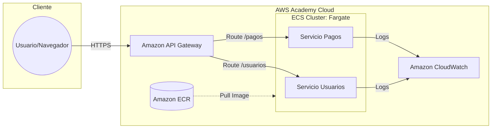

# 🚀 MicroPay: Arquitectura de Microservicios Orquestados en AWS

Este repositorio contiene la documentación y configuración de la arquitectura de microservicios para la fintech **MicroPay**. El proyecto migra un monolito tradicional hacia una infraestructura moderna, desacoplada y serverless utilizando **Amazon ECS Fargate**.

---

## 📋 Descripción del Proyecto
El objetivo principal fue el despliegue de dos microservicios críticos (**Usuarios** y **Pagos**) garantizando escalabilidad, independencia de despliegue y una exposición centralizada a través de una API HTTP.

## 🏗️ Diagrama de Arquitectura
La solución se basa en pilares de AWS para asegurar alta disponibilidad y bajo acoplamiento:

## 🛠️ Tecnologías Utilizadas

* **Contenerización:** `Docker` (Imágenes optimizadas para microservicios).
* **Registro:** **Amazon Elastic Container Registry** (`ECR`).
* **Orquestación:** **Amazon Elastic Container Service** (`ECS`) con **AWS Fargate** (Modelo Serverless).
* **Exposición:** **Amazon API Gateway** (`HTTP API`) para enrutamiento centralizado.
* **Monitoreo:** **Amazon CloudWatch Logs** para observabilidad y trazabilidad en tiempo real.
* **Seguridad:** Configuración de `IAM Roles` (**LabRole**) y `Security Groups` (**SG**) basados en el principio de mínimo privilegio.

---

## 🚀 Implementación Detallada

### 1. Contenerización y Registro
Se desarrollaron archivos `Dockerfile` para cada microservicio. Las imágenes resultantes fueron etiquetadas y cargadas en repositorios privados de **Amazon ECR**, utilizando la etiqueta `:latest` para asegurar la integración continua del código más reciente.

### 2. Orquestación Serverless
Se configuraron las **Task Definitions** en ECS, asignando recursos específicos de CPU y Memoria (Fargate). Esto garantiza que cada contenedor se ejecute de forma aislada, eliminando la necesidad de administrar instancias EC2 y optimizando la disponibilidad.

### 3. Exposición vía API Gateway
Se implementó un punto único de entrada para la aplicación mediante **Integraciones HTTP URI**, redirigiendo el tráfico según la ruta solicitada:

* `GET /usuarios` ➔ Redirección a la **IP Pública** del microservicio de Usuarios.
* `GET /pagos` ➔ Redirección a la **IP Pública** del microservicio de Pagos.

### 4. Monitoreo y Observabilidad
Implementación nativa de **CloudWatch Logs**, permitiendo la captura de logs de la aplicación. Se crearon `Log Streams` específicos para cada tarea de ECS,
